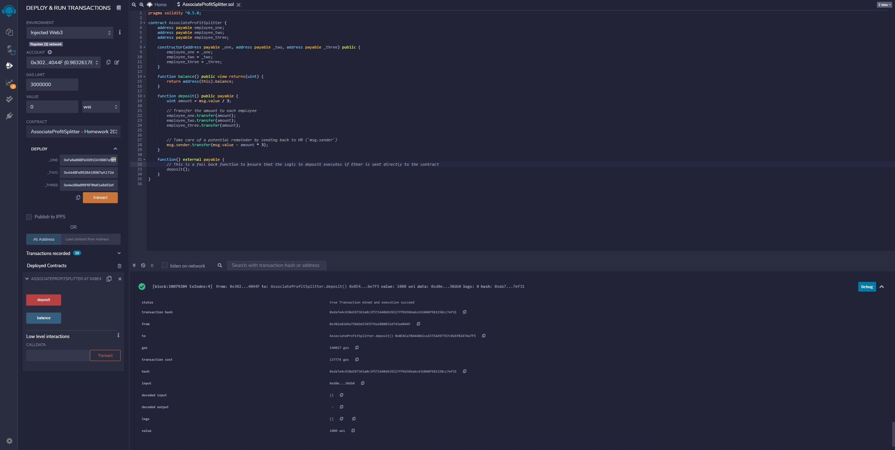
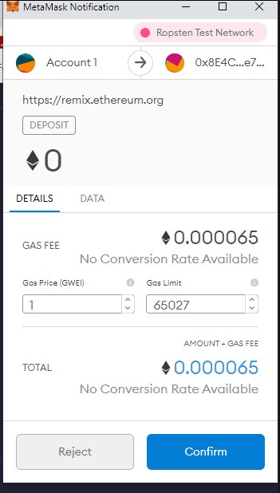
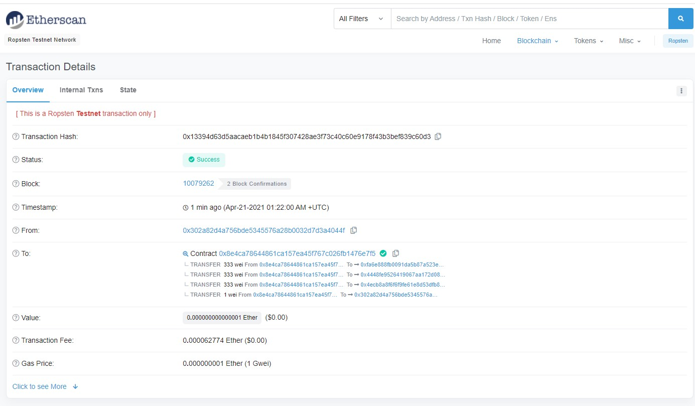
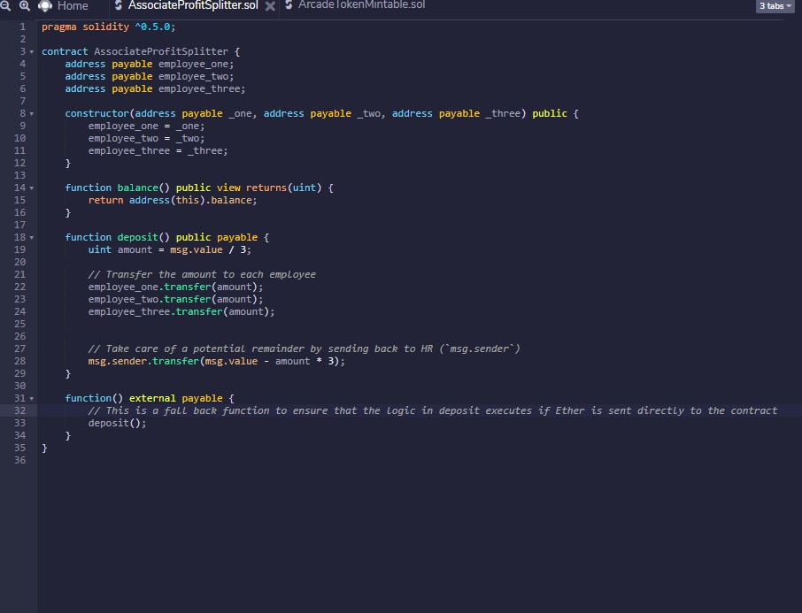
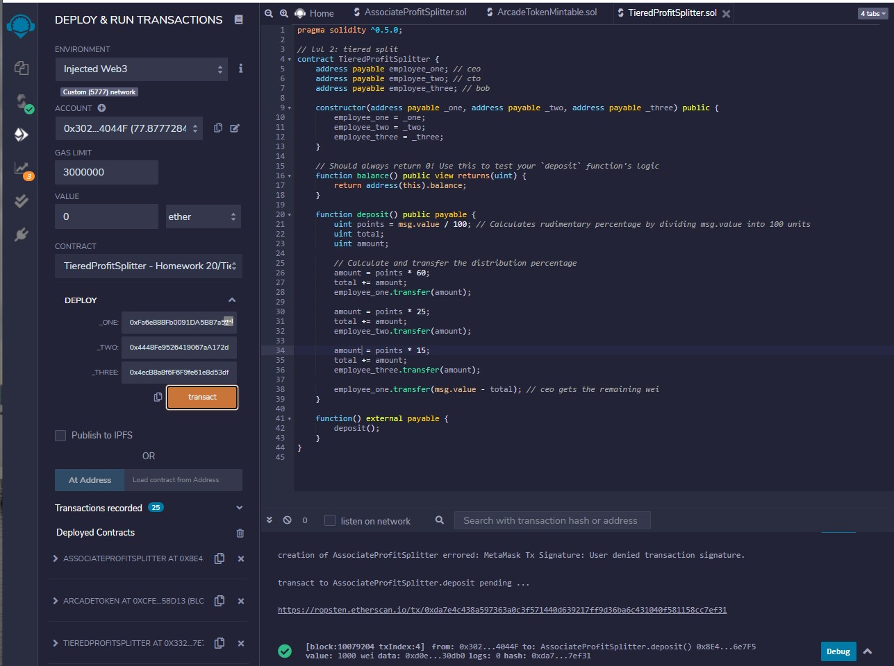
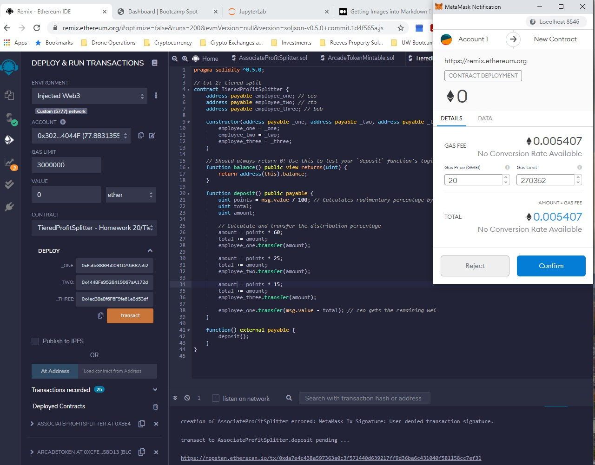
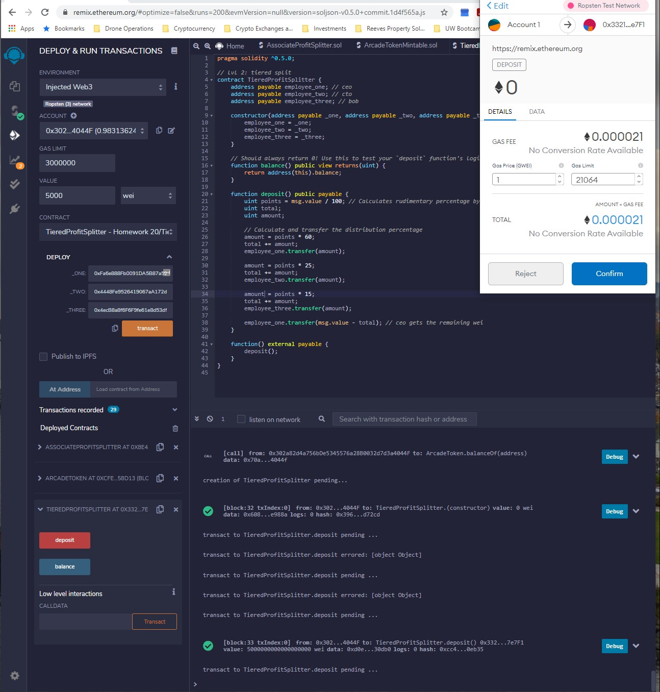
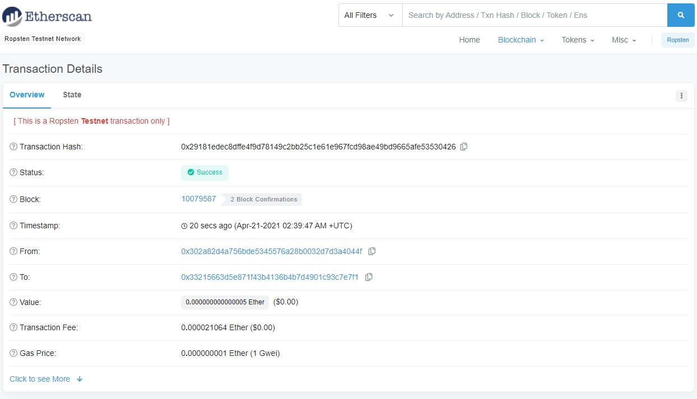
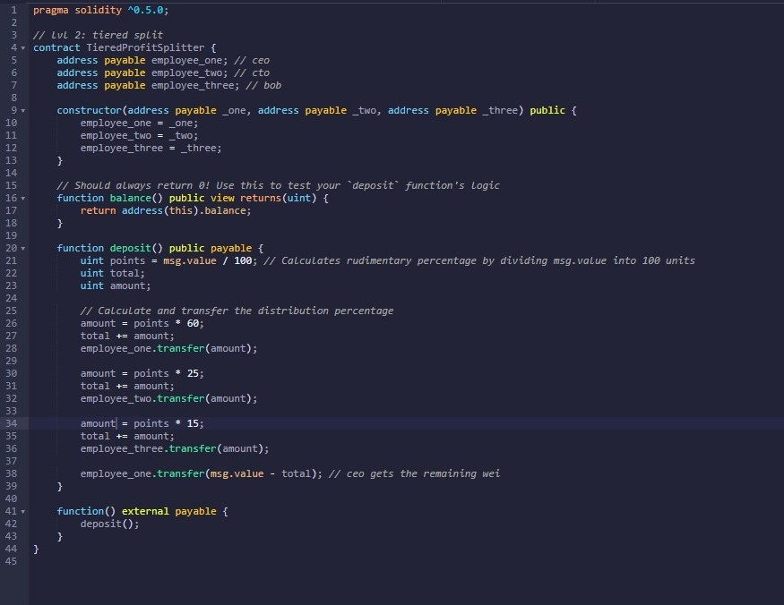

# Level-One: Associate Profit Splitter

## How The Contract Works and Motivation

### This contract was created to enable a quick and easy way to dissemenate funds to employees, split profit sharing, and distribute shares in a "deferred equity incentive plan".

## How to Send Transactions

### Deploy the Contract:

    1. Before deploying with "transact" button, select a value of "0" first.

    
    2. Enter your three account addresses under the deploy tab.
    
    3. Make sure your environment is "Injected Web3" and that you are on the proper network, in this case Ropsten Test Network.
    
    4. Click the "transact" button once steps 1-3 are completed.
    
    5. This will bring up Metamask automatically (assuming it is logged in appropriately) where you will review and confirm the transaction for deployment.

### How the Transferred Amount is then Distributed from each of the Contracts

    1. Now that the contract is deployed, look for the red "deposit" button below the deployed contract.

    2. Before selecting that button though, make sure you have now entered an amount of ETH in the "value" field above the "deploy" field.
    
    3. Now select the deposit button and watch for Metamask to pop up with the transaction which you will then confirm.

    4. When the transaction is complete, it will notify you at the bottom window of the RemixIDE.
    
    5. You can click on the http://ropsten.etherscan.io.... link that describes the transaction.

    6. Here you can look for the transactions to confirm they are fulfilled successfully.
    
# CODE:

# Level-Two: Tiered Profit Splitter

## How the Contract Works and Motivation

### This contract was created to design an easy way to split profits between the CEO, CTO and Bob with percentages of split as indicated in the code. The CEO will get 60%, the CTO will get 25%, and Bob will get 15%.

## How to Send Transactions

### Deploy the Contract:
    1. Before deploying with the "transact" button, select a value of "0" first.

    2. Enter your three account addresses under the deploy tab.
    
    3. Make sure your environment is "Injected Web3" and that you are on the proper network, in this case Ropsten Test Network.
    
    4. Click the "transact" button once steps 1-3 are completed.
    
    5. This will bring up Metamask automatically where you will review and confirm the transaction for deployment.

### How the Transferred Amount is then Distributed from each of the Contracts
    1. Now that the contract is deployed, look for the red "deposit" button below the deployed contract.

    2. Before selecting that button however, make sure you have now entered an amount of ETH in the "value" field above the "deploy" field.
    
    3. Now select the deposit button and watch for Metamask to pop up with the transaction which you will then confirm.
    
    4. When the transaction is complete, it will notify you at the bottom window of the RemixIDE.
    
    5. You can click on the http://ropsten.etherscan.io.... link that describes the transaction.

    6. Here you can look for the transactions to confirm they are fulfilled successfully.
    
# CODE:
